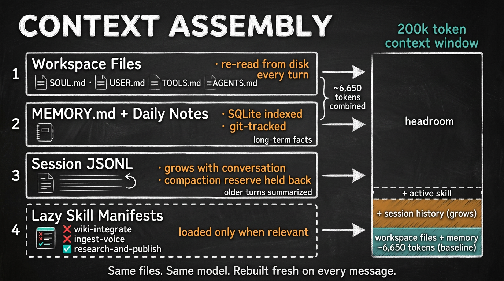
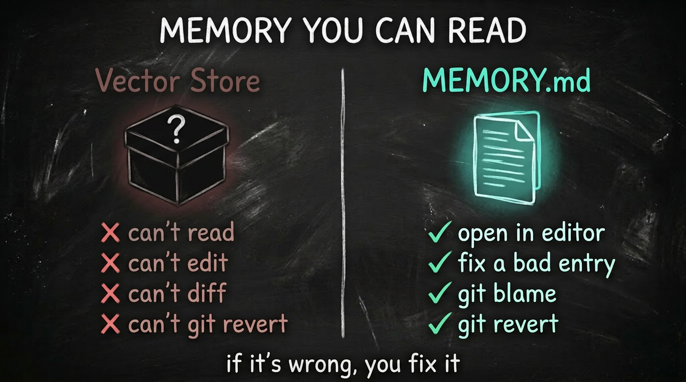
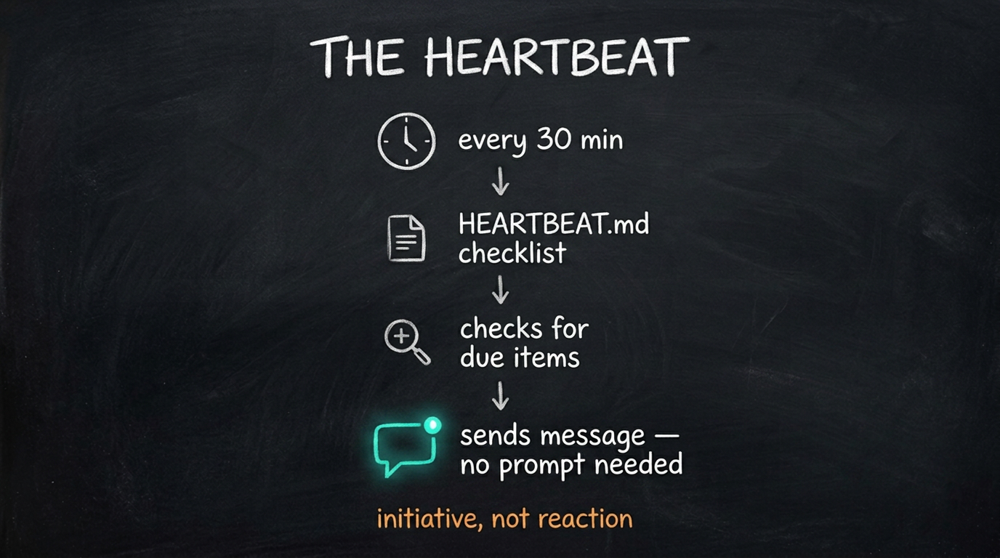
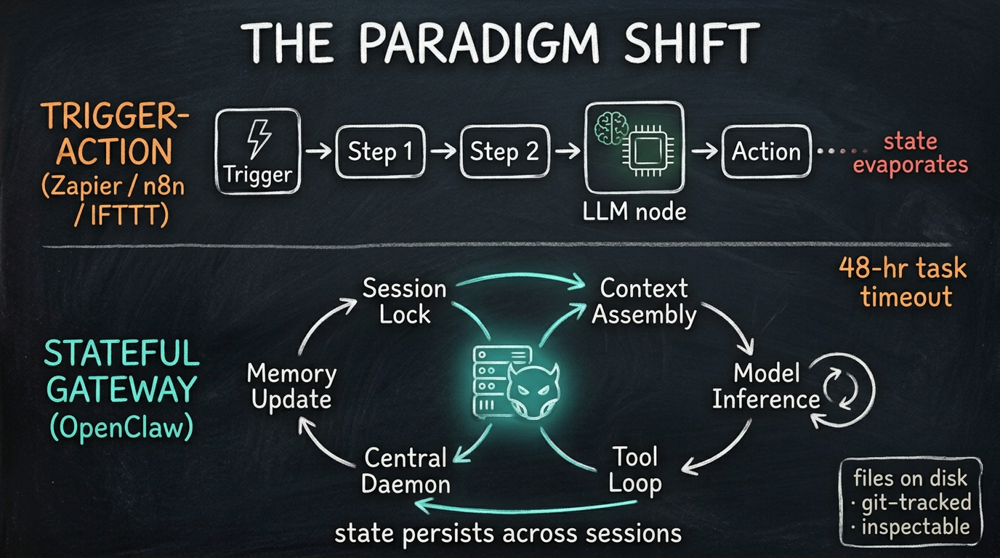
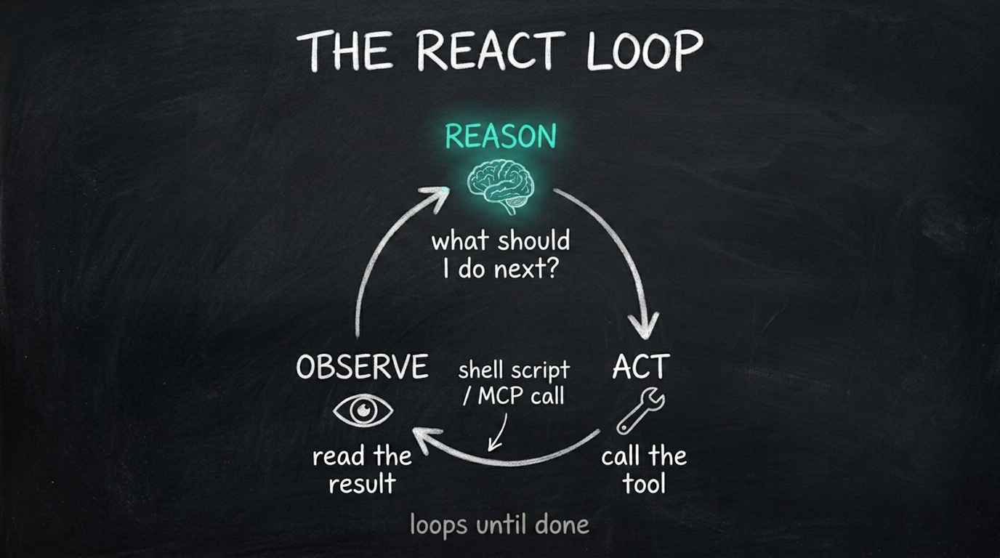

# Architecture — OpenClaw Context, Memory, and Session Model

Technical reference for how OpenClaw assembles prompts, manages sessions, and persists state. Grounded in OpenClaw v2026.4.8 running on EC2 with Claude Sonnet 4.6 via Amazon Bedrock.

---

## Session boundaries and identity

The OpenClaw gateway defines sessions by JID (Jabber ID — the same concept Telegram and WhatsApp inherited). For each chat, a unique session key is derived:

| Session type | Key format | State persistence |
|---|---|---|
| Direct message (owner) | `agent:main:main` | Persistent across restarts |
| Individual peer | `agent:<id>:peer:<jid>` | Isolated per contact |
| Group chat | `agent:<id>:group:<jid>` | Isolated per group |
| Heartbeat / cron | `agent:main:heartbeat` | Ephemeral |

For 1 DM + 5 group topics, the gateway maintains **6 concurrent sessions** with strict data isolation between them.

Sessions persist until a reset condition occurs:

| Condition | Action |
|---|---|
| Gateway restart (`systemctl restart`) | Resumes from saved JSONL transcript |
| Daily reset (4:00 AM host time) | Archives history; starts fresh session |
| Manual `/new` or `/reset` | Wipes active context |
| `idleMinutes` timeout | Starts fresh after inactivity |

---

## Context injection per request



Every incoming message triggers a full prompt assembly in this order:

1. System-level framework instructions
2. `SOUL.md` — personality and tone
3. `USER.md` — user profile
4. `TOOLS.md` — available tool schemas
5. `AGENTS.md` — operational rules and SOP
6. `MEMORY.md` — **conditional: main session (DM) only, never in group chats**
7. `memory/YYYY-MM-DD.md` — today's + yesterday's daily logs
8. Conversation history (up to compaction limit)
9. Incoming message

### Main session vs group chat

`MEMORY.md` is deliberately withheld in group chats to prevent leaking private long-term facts (API keys, personal context, project details) into multi-user spaces. Main session status is determined at the gateway level by comparing the sender's JID against the owner account.

This is the most important access-control boundary in the system: the model itself doesn't know whether it's in a group or a DM. The gateway makes that decision at prompt-assembly time and includes or omits the curated memory accordingly.

---

## Conversation history storage

All session data lives on the EC2 instance at `~/.openclaw/agents/<agentId>/sessions/`:

- `sessions.json` — manifest of active/archived sessions with timestamps and token stats
- `<sessionId>.jsonl` — append-only line-delimited JSON transcript (one turn per line: user messages, assistant replies, tool calls, tool results)

No cloud database. No fixed message limit on disk. Survives `systemctl restart`. The only limit is how much of the JSONL history fits in the 200K context window per turn.

---

## Compaction

### Current config

```json
"compaction": {
  "mode": "default",
  "reserveTokensFloor": 40000
}
```

### Mode comparison

| Mode | Proactivity | Strategy | When to use |
|---|---|---|---|
| `none` | None | Truncates only | Testing |
| `safeguard` | Reactive (waits for error) | Summarizes after `context_length_exceeded` | Not recommended for 200K windows |
| `default` | Proactive (threshold-based) | Summarizes at token threshold | Standard production |
| `aggressive` | Proactive, frequent | Frequent summarization | Cost-sensitive |
| `smart` | Dynamic | Content-aware pruning | Experimental |

**Why `safeguard` is wrong for 200K:** With a large window, the summarization request itself can exceed model limits when it's triggered (at ~180K tokens), causing a silent failure — "Summary unavailable" in logs, history truncated without an AI-generated summary. `default` with `reserveTokensFloor: 40000` compacts proactively before hitting that limit.

### What survives compaction

Workspace files (`SOUL.md`, `USER.md`, `TOOLS.md`, `AGENTS.md`, `MEMORY.md`) are unaffected — they are re-injected fresh from disk at the start of every turn, regardless of compaction cycles.

---

## Three-tier memory



| Tier | Location | Scope | Created by |
|---|---|---|---|
| Session history | `~/.openclaw/agents/.../sessions/<id>.jsonl` | Per-session, ephemeral at reset | Gateway, automatic |
| Daily tactical log | `~/.openclaw/workspace/memory/YYYY-MM-DD.md` | Raw log of what happened today | Agent writes autonomously |
| Long-term curated | `~/.openclaw/workspace/MEMORY.md` | Distilled facts across all sessions | Agent promotes during heartbeats |

Without `MEMORY.md` and the `memory/` directory, the agent has zero cross-session recall. It remembers within a session but forgets everything on daily reset.



The heartbeat process reviews daily logs and promotes recurring facts (mentioned 3+ times) into `MEMORY.md`, creating a self-improving memory loop without user intervention.

---

## Group chat access control (Telegram and WhatsApp)

Three gates per incoming message:

1. **Access gate** — is the group/sender in the allowlist? If not, the message is **dropped entirely** (not even added to the history buffer).
2. **Mention gate** — does the message `@mention` the agent or reply to it? (`requireMention: true` by default; can be set per-topic.)
3. If both pass → agent responds; if only gate 1 passes → message is buffered for context but agent stays silent.

**Known limitation:** If primary speakers in a group aren't on the allowlist, their messages are dropped at gate 1 and the agent has no conversational context for their threads.

Each group/topic maintains its own isolated JSONL transcript — Group A never sees Group B's history.

---

## Token budget (200K window, Sonnet 4.6)

| Component | Approx tokens | % of window |
|---|---|---|
| System prompt + framework | ~2,000 | 1% |
| `SOUL.md` | ~500 | 0.25% |
| `AGENTS.md` | ~2,500 | 1.25% |
| `TOOLS.md` | ~500 | 0.25% |
| `USER.md` | ~150 | 0.1% |
| `MEMORY.md` | ~1,000 | 0.5% |
| **Bootstrap total** | **~6,650** | **~3.3%** |
| Available for history + output | **~193,350** | **~96.7%** |

Tool results (web scrapes, code output) are the largest source of token consumption beyond workspace files.

---

## Comparison: OpenClaw vs ChatGPT



| Feature | ChatGPT | OpenClaw |
|---|---|---|
| History storage | Managed cloud DB | Local JSONL on a VM you own |
| Cross-session memory | Cloud-synced "Memory" | `MEMORY.md` + `memory/*.md` (local files) |
| Context window | Opaque, server-managed | Transparent; re-sent every turn |
| Task automation | GPTs / Agent mode | Heartbeats / Skills / Cron |
| Proactivity | Purely reactive | Proactive via heartbeat daemon |
| Multi-turn | Session-based | Session-based + persists across reboots |

The key difference: ChatGPT manages history server-side invisibly. OpenClaw packages the entire relevant state into the prompt on every turn. More transparent, more controllable, more expensive per-token — but you own everything.

OpenClaw's proactive heartbeat is the structural advantage: it can wake up, check something, and message you on Telegram without any incoming trigger. ChatGPT cannot.

## The ReAct loop in practice



Every turn that touches a tool is a small ReAct loop: the model reasons about what to do, picks a tool from `TOOLS.md`, calls it, receives the result back into the conversation, and decides whether to call another tool or respond. There's no fixed depth limit — the gateway just keeps feeding tool results back until the model stops asking for tools.
